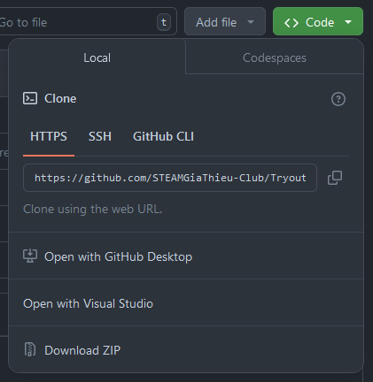

# Tài liệu hướng dẫn Tryout</br> STEAM Gia Thiều - Năm 2024

<!-- > Tham khảo phần cứng robot [tại đây](mechanic/) -->

## Cần chuẩn bị những gì?

* Kiến thức và kỹ năng:
    - Ngôn ngữ lập trình C/C++
    - Tín hiệu PWM
    - Điều khiển động cơ bằng tín hiệu PWM
    - Mạch cầu H
    - *[ESP32 PWM on Arduino framework](https://randomnerdtutorials.com/esp32-pwm-arduino-ide/)*
    - *[ESP32 BluetoothSerial](https://randomnerdtutorials.com/esp32-bluetooth-classic-arduino-ide/)*
    </br>
Đối với những thí sinh chưa biết phần cơ bản, có thể tham khảo [tại đây](https://github.com/sgtsince2022/BEGINNER_TUTORIALS)

* Các công cụ và driver cần cài đặt:
    - Git hoặc GitHub-CLI hoặc GitHub Desktop
    - Visual Studio Code
    - PlatformIO for Visual Studio Code - Cần sử dụng ngôn ngữ C/C++
    - Driver CP210x và CH340 để nạp chương trình cho chip


* Clone hoặc tải repo Github này xuống để lấy thư mục [*Tryout-Bot*](Tryout-Bot) </br>

    Tải zip: Chọn Code => Download ZIP
    
    
    
    Dùng lệnh Git để clone:
```
    git clone https://github.com/STEAMGiaThieu-Club/Tryout2024.git
```

> [!Note]
> Lưu ý
> 
> * Không sử dụng Arduino IDE hay các công cụ kéo thả như Scratch để lập trình
> * Các bạn được phép sử dụng sự hỗ trợ từ bất kỳ công cụ AI nào trước khi đến thời điểm tập trung offline cho vòng Tryout, cũng như sự hỗ trợ từ các mentor của câu lạc bộ

## Một số yêu cầu cần biết trước Tryout cho các thí sinh đảm nhiệm vị trí lập trình

* Thí sinh tạo tài khoản GitHub cá nhân *(nếu chưa có)*
* Thí sinh clone repo này xuống máy tính cá nhân như đã hướng dẫn ở trên, sau đó push thư mục Tryout-Bot lên trang GitHub cá nhân dưới dạng một repo[^1]

[^1]: repo - hay repository - là một đơn vị kho lưu trữ code trên GitHub

## Thư viện điều khiển động cơ có sẵn
Tryout-Bot là một thư mục theo chuẩn Project của PlatformIO, trong đó đã có một thư viên <esp32_motor.hpp> được SGT viết sẵn để hỗ trợ người mới điều khiển động cơ, thư viện được đặt trong thư mục [lib\DC Motor](Tryout-Bot/lib/DC%20Motor)